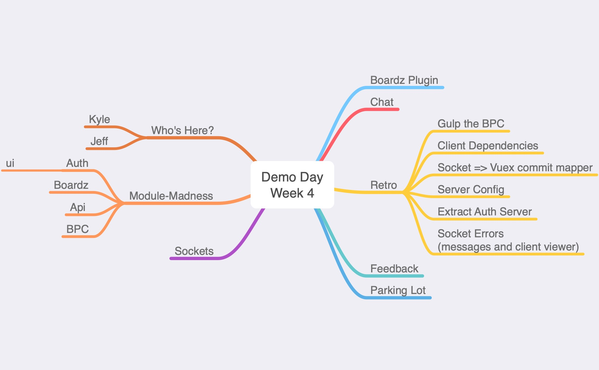

# 
Demo Day

### 
Friday May 15th, 2020

### Week 4
First demo day for the Boardz.app system!! This week the focus was purely on the system foundation and architecture. 

### Who Joined?
Jeff & Kyle
 
### Topics
- VueJs & Vuex TypeScript module architecture
- VueJs Authentication module
- The "BPC" - The Build | Pack | Copy npm package management process
- WebSockets using Socket.io
- Chat Server

#### Module Architecture using TypeScript, VueJs, Vuex, and Socket.io

The system is being built towards a component based architecture. This means the goal is to build the smallest possible unique features into an independent components that can be used inside other modules.

Everything is written in TypeScript using Jest for unit testing. The current client framework is VueJs. Modules using Vue are marked. Socket.io is used as a middle tier for pulling data from the back end API (a.k.a. the "Platform").

Currently the Boardz.app system has the following modules:

- Client (VueJs)
- Api
- Auth
- Auth UI (VueJs)
- Boardz
- Config
- Server

#### The "BPC" - The Build | Pack | Copy npm package management process

The current strategy for module management is using npm pack to package each module and then npm install that module in consumers. Details on the BPC flow will be documented in the repo once it's moved from a manual build process to Gulp tasks An item has been added to the Retro for this.

#### WebSockets using Socket.io

The current WebSockets framework is Socket.io. This was chosent because of its maturity as a framework, simplicity, ease of integration with Vuex, and marketshare.

#### Chat Server

The Chat-Server from <a href="https://github.com/luixaviles/socket-io-typescript-chat">socket-io-typescript-chat</a> has been included with plans to build out a VueJs port.

## Feedback

{S} : Demo Page should have more flar. Fun it up. (i.e. Dev.to style)

## Parking Lot

- "App this Board" button
- "Push to talk" / "Push to video" modules
- Developer Experience

## Retrospective

##### Unit Tests
The architecture stabilized this week so no more slacking on tests. The BPC process encourages unit tests so that should help.

Goal: Code Coverage metrics

##### Client Dependencies
Still having issues with the Client app BPC process. Work out the issues and bake it into Gulp.

##### Gulp the BCP
Manual steps should move into Gulp Tasks. Package level to start. It can run unit tests and then when they pass package the module and copy it.

Goal: Build out basic Gulp flow

##### Abstract Socket.on configuration
Everything inside of configureListeners can be abstracted to just work based on the Vuex store MutationTree.

Goal: Eliminate Socket.io config code inside the modules

##### Extract Auth Server
Currently it's in the boardz. Move it to its own folder. Then move them all out to modules.

Goal: Move it!

##### Client Errors
Decide how to handle client side errors for now. Ideally use something to give devtools in all browsers and include xhr, sockets, and JS errors.

Goal: Look into options and cleanup existing console logging